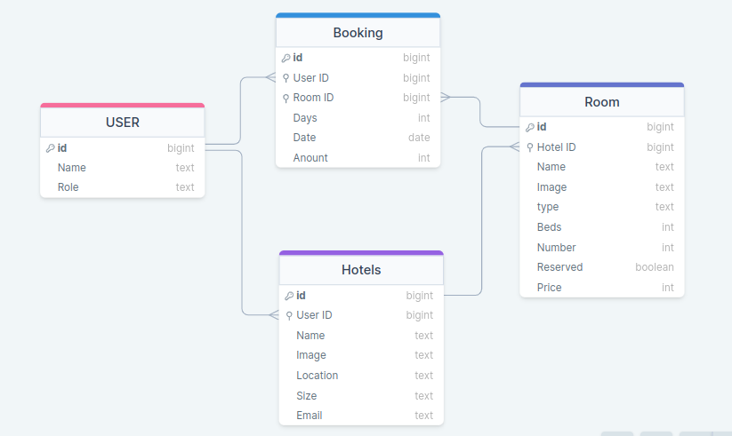

<!-- TABLE OF CONTENTS -->

# 📗 Table of Contents

- [📖 About the Project](#about-project)
  - [🛠 Built With](#built-with)
    - [Schema Design](#schema)
    - [Tech Stack](#tech-stack)
    - [Key Features](#key-features)
  - [🚀 Live Demo](#live-demo)
  - [🚀 Frontend Link](#frontend-link)
- [💻 Getting Started](#getting-started)
  - [Setup](#setup)
  - [Prerequisites](#prerequisites)
  - [Install](#install)
  - [Usage](#usage)
  - [Run tests](#run-tests)
  - [Deployment](#triangular_flag_on_post-deployment)
- [👥 Authors](#authors)
- [🔭 Future Features](#future-features)
- [🤝 Contributing](#contributing)
- [⭐️ Show your support](#support)
- [🙏 Acknowledgements](#acknowledgements)
- [❓ FAQ (OPTIONAL)](#faq)
- [📝 License](#license)

<!-- PROJECT DESCRIPTION -->

# 📖 Hotel Backend <a name="about-project"></a>

**Hotel Backend** is a backend application interface providing secured endpoints for booking hotel rooms.

## 🛠 Built With <a name="built-with"></a>

### Schema Design <a name="schema"></a>


### Tech Stack <a name="tech-stack"></a>

<details>
  <summary>Server</summary>
  <ul>
    <li><a href="https://expressjs.com/">Ruby on Rails</a></li>
  </ul>
</details>

<details>
<summary>Database</summary>
  <ul>
    <li><a href="https://www.postgresql.org/">PostgreSQL</a></li>
  </ul>
</details>

<!-- Features -->

### Key Features <a name="key-features"></a>

- **Implement Authenticated endpoint**
- **Implement CRUD functionality for hotels model**
- **Implement CRUD functionality for rooms model**
- **Implement CRUD functionality for booking model**

<p align="right">(<a href="#readme-top">back to top</a>)</p>

<!-- LIVE DEMO -->
## 🚀 LIVE DEMO <a name="live-demo"></a>
- [Link to Live Demo](http://hotel-backend.fly.dev/)

<p align="right">(<a href="#readme-top">back to top</a>)</p>

<!-- FRONT END LINK -->

## 🚀 Frontend Link <a name="frontend-link"></a>


- [Link to Frontend Code](https://github.com/t-bello7/hotel-frontend)

<p align="right">(<a href="#readme-top">back to top</a>)</p>

<!-- GETTING STARTED -->

## 💻 Getting Started <a name="getting-started"></a>

To get a local copy up and running, follow these steps.

### Prerequisites

In order to run this project you need:
- Ruby 
- Postgres

### Setup

Clone this repository to your desired folder:

```sh
  git clone https://github.com/t-bello7/hotel-backend.git
```

### Install

Install this project with:

```sh
  cd hotel-backend
  bundle install
```

### Usage

To run the project, execute the following command:

```sh
  bin/rails server
```
### Run tests

To run tests, run the following command:

```sh
  bin/rails spec 
```

### Deployment

You can deploy this project using [Fly](https://fly.io)

<p align="right">(<a href="#readme-top">back to top</a>)</p>

<!-- AUTHORS -->

## 👥 Authors <a name="authors"></a>

👤 **Author1**

- GitHub: [@t-bello7](https://github.com/t-bello7)
- Twitter: [@__tbello](https://twitter.com/__tbello)
- LinkedIn: [Bello Oluwatomisin](https://linkedin.com/in/tbello7)

👤 **Author2**

- GitHub: [@stephnna](https://github.com/stephnna)
- LinkedIn: [Stephen Ezea](https://www.linkedin.com/in/stephen-nnabuike-ezea-143b97170/)

<p align="right">(<a href="#readme-top">back to top</a>)</p>

<!-- CONTRIBUTING -->

## 🤝 Contributing <a name="contributing"></a>

Contributions, issues, and feature requests are welcome!

Feel free to check the [issues page](../../issues/).

<p align="right">(<a href="#readme-top">back to top</a>)</p>

<!-- SUPPORT -->

## ⭐️ Show your support <a name="support"></a>

If you like this project kindly star the project

<p align="right">(<a href="#readme-top">back to top</a>)</p>

<!-- ACKNOWLEDGEMENTS -->

## 🙏 Acknowledgments <a name="acknowledgements"></a>

We would like to thank microverse and the open source community for resources and Knowledge

<p align="right">(<a href="#readme-top">back to top</a>)</p>


<!-- LICENSE -->

## 📝 License <a name="license"></a>

This project is [MIT](./License) licensed.

<p align="right">(<a href="#readme-top">back to top</a>)</p>
